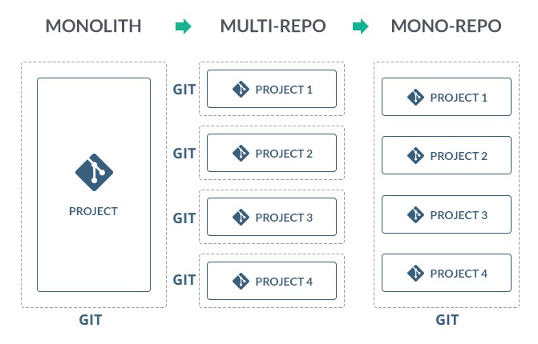

# Micro Frontend Architecture with Angular 

Cloud native applications benefit from Microservices architecture. By decouple business domains we are able to independently scale, reduce friction, increase fault tolerance and solve many problems associated with monolithic architectures. However, the UI Applications still follow monolithic architecture, covering the entire sub-domain. Can we apply the same to Monolithic UI Applications ? The answer is yes. This repo is created to consolidate guiding principles for building micro-front ends. Although it is not limited to any particular framework like Angular, React or Vue, this repo contains sample code for building microfront ends using Angular.  

## Micro frontend (MF)
A microfront end is a client side architecture, where each component is responsible only for one sub-domain of the business. A common shell is used to load the components.

## Features 
List of key features of a micro-front end architecture.
- Owned by one team - One team owns one or more micro-frontends. The team is responsible for the module instead of an individual.
- Shared state management - Make sure that your micro app is not containing a data store state, it has to be separated into a shareable data layer. 
- Independent deployment - Each of the micro-apps has to be deployed individually as they are hosted in a separate domain. Also, make sure to make each of the pipelines as decoupled as possible.
- Decouple Components (Shared UI Library**) - The components should not have any direct interaction. 
- Fault Tolerance -  If one of the micro-app is broken, the other will still be functioning

## Angular / Nx concepts 
It is important to understand below concepts before moving forward and understanding Microfront end architecture using Angular / NX

### Monorepo

Angular provides a way to set up one workspace with multiple projects and libraries sharing the same dependencies across all projects. 

Alternatives: BIT.dev, lerna.js.org, Git Sub modules 

### NX CLI

How do you run a monorepo subproject? [NX](https://nx.dev/) is a smart, fast and extensible build system with first class monorepo support and powerful integrations. NX provides several npm run scripts to run each project and do other things.

### Module Federation (Webpack 5)

#### Problems with SPA
-  Builds can become unacceptably slow (Webpack assume that the entire program code is available when compiling.)
-  Long dev-server startup times
-  Splitting the SPA into multiple projects leads to 
   -  Cognitive overhead 
   -  Coordinating build and deployment
   -  Version-Mismatch-Hell 
   -  Sharing state
#### Solution
- Module Federation provides a solution to the scaling problem by allowing a Single Page Application (SPA) to be sliced into multiple smaller remote applications that are built independently and that are not yet known at compile time.
- Module federation allows a JavaScript application to dynamically load code from another application 
- Federated code can always load its dependencies but will attempt to use the consumers’ dependencies before downloading more payload. 

#### Dynamic Module Federation.

Dynamic Module Federation allows you to build once and deploy everywhere, across environments. 

** Important
- [Speculation] Angular 14 may support Microfront ends 

## Further Reading
- https://itnext.io/how-micro-frontend-changes-the-future-of-angular-bb4deb2cfdad
- https://itnext.io/what-to-expect-from-angular-14-in-2022-is-micro-frontend-coming-7932566f773
- Step by step instructions for building MF apps 
  - https://itnext.io/building-angular-micro-frontend-with-ngrx-state-sharing-and-nx-cli-7e9af10ebd03
  - https://nx.dev/getting-started/intro
  - https://levelup.gitconnected.com/your-first-angular-microfrontend-58950768a465